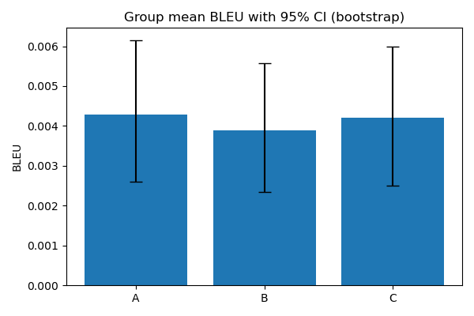
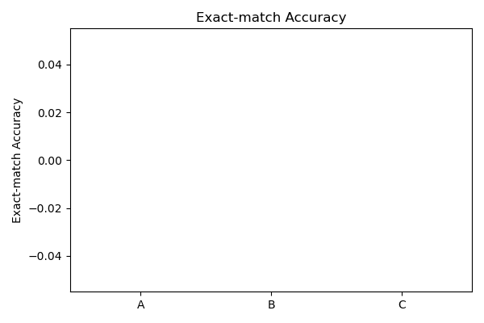

# 分析汇总

- 样本数: 500
- 平均 BLEU (A): 0.004295, bootstrap mean 0.004275, 95% CI (0.0025980174561693165, 0.006151793883361359)
- 平均 BLEU (B): 0.003884, bootstrap mean 0.003868, 95% CI (0.0023511709017182475, 0.005576611499879242)
- 平均 BLEU (C): 0.004204, bootstrap mean 0.004188, 95% CI (0.0024996357967009505, 0.005990770183399045)

## 精确匹配(辅助)
- Accuracy A: 0.0000
- Accuracy B: 0.0000
- Accuracy C: 0.0000

## McNemar 检验(p-values, normal approx):
- A vs B: p=1.000000, b=0, c=0
- A vs C: p=1.000000, b=0, c=0
- B vs C: p=1.000000, b=0, c=0

## 可视化

